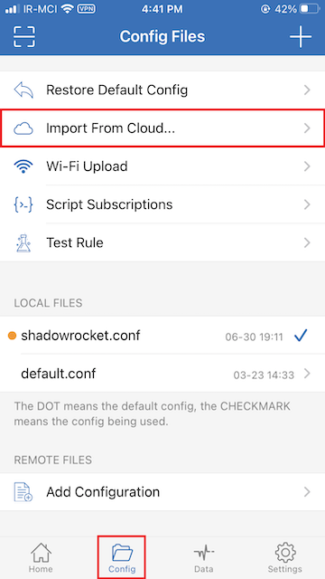
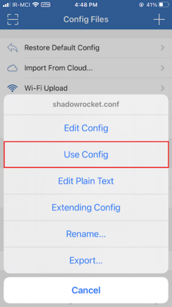
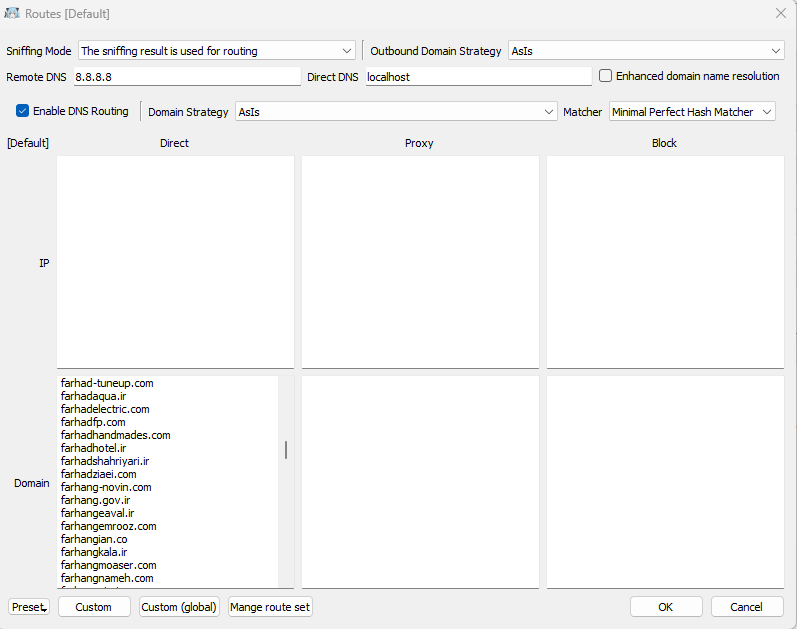

<div dir=rtl>

#  دامنه‌های میزبانی شده در ایران

بسیاری از سرویس‌ها و دامنه‌های خارج از ایران سانسور و مسدود شده‌اند و باید برای دسترسی به آن‌ها از VPN و Proxy هایی با امنیت بالا استفاده کنیم، جدای از این مسئله دسترسی به بعضی سرویس‌های ایرانی از طریق IP خارجی مسدود شده است. حال برای دور زدن این سرویس ها لیستی از دامنه‌های داخلی را جمع کرده‌ایم تا با اضافه کردن آن‌ به کلاینت‌های مورد استفاده، دیگر نیاز به قطع کردن VPN برای دسترسی به سرویس‌های داخلی نباشد.

## سلب مسئولیت
  این مخزن فهرستی گردآوری شده از منابع عمومی و در دسترس مردم در مورد وب سایت های میزبانی شده در ایران است. این فقط برای مقاصد اطلاعات عمومی در نظر گرفته شده است و برای ارائه راهنمایی در مورد نحوه اتصال یا ایجاد یا مدیریت یک شبکه خصوصی مجازی (VPN) در نظر گرفته **نشده** است. محتوای این مخزن همانطور که هست ارائه شده است و ما هیچ گونه اظهارنظر یا ضمانتی، صریح یا ضمنی، در مورد کامل بودن، دقت، قابلیت اطمینان، مناسب بودن یا در دسترس بودن اطلاعات موجود در این مخزن نداریم. هر گونه اتکای شما به چنین اطلاعاتی کاملاً به عهده شماست. ما مسئولیتی در قبال خطاها یا حذفیات در اطلاعات یا هر گونه ضرر، خسارت یا سایر تعهدات ناشی از استفاده از آن نخواهیم داشت. لطفاً قبل از استفاده از هر گونه اطلاعات این مخزن احتیاط کنید و با یک متخصص واجد شرایط مشورت کنید.
  

## روش استفاده

### [Clash](https://github.com/Dreamacro/clash) (Like [ClashX](https://github.com/yichengchen/clashX) / [clash_for_windows_pkg](https://github.com/Fndroid/clash_for_windows_pkg) / [Clash .NET](https://github.com/ClashDotNetFramework/ClashDotNetFramework/releases) / ...)

1. صفحه‌ی پروفایل/تنظیمات فعلی خود را که استفاده می‌کنید باز کنید.  
2. این خطوط را به فایل اضافه کنید:  
```yaml
rule-providers:
  iran:
    type: http
    behavior: classical
    url: "https://raw.githubusercontent.com/matador7495/iran-domains/main/clash_rules.yaml"
    path: ./ruleset/database-iran.yaml
    interval: 86400
```
* بصورت خودکار هر 24 ساعت آپدیت می شود.

3. سپس خط زیر را به بخش قوانین `Rules` اضافه کنید:  
```yaml
  - RULE-SET,iran,DIRECT
```

4. فایل را ذخیره کنید.  
5. بستگی به نوع کلاینت، ممکن است لازم باشد نرم‌افزار را روی حالت `Rule‍` تنظیم کنید.  

#
### Proxy SwitchyOmega افزونه
[لینک دانلود آخرین نسخه فایل qv2ray_schema.json](https://github.com/matador7495/iran-domains/releases/latest)

محتوا فایل را در پروفایل proxy بخش مربوط به Bypass List قرار دهید

#
### [Qv2ray](https://github.com/Qv2ray/Qv2ray)

1. فایل switchy_omega را دانلود کنید.
[لینک دانلود آخرین نسخه فایل switchy_omega.txt](https://github.com/matador7495/iran-domains/releases/latest)
2. در بخش `preferences` بر روی `Advanced Route Settings` کلیک کنید.
3. در پایین صفحه، بر روی `import schema...` کلیک کنید.
4. فایل qv2ray_schema.json دانلود شده را انتخاب کنید.
5. در کادر باز شده بر روی yes کلیک کنید.
6. بر روی OK کلیک کنید.


#
### [Shadowrocket](https://apps.apple.com/us/app/shadowrocket/id932747118)

1. فایل `shadowrocket.conf` را دانلود کنید.
[لینک دانلود آخرین نسخه فایل shadowrocket.conf](https://github.com/matador7495/iran-domains/releases/latest)
2. در اپلیکیشن بر روی `Import From Cloud` کلیک کرده و فایل مربوط را اضافه کنید.
3. در نهایت، بر روی `shadowrocket.conf`کلیک کرده و `Use Config` را انتخاب کنید.

<table>
  <tr>
    <td>   </td>
    <td>   </td>
   </tr>
  </tr>
</table>

#
### [Nekoray](https://github.com/MatsuriDayo/nekoray)

1. در ابتدا فایل `domains.txt` را دانلود کنید.
[لینک دانلود آخرین نسخه فایل domains.txt](https://github.com/matador7495/iran-domains/releases/latest)
2. سپس nekoray را باز کنید و روی آیکون `program` بالا سمت چپ کلیک کنید
3. سپس به ترتیب روی دکمه `preferences` و `routing setting`  کلیک کنید
4. محتوا فایل دانلود شده را در قسمت Direct-Domain جایگذاری کنید.
5. سپس بر روی OK کلیک کنید و برنامه را دوباره اجرا کنید.

<table>
  <tr>
    <td>  </td>
   </tr>
  </tr>
</table>

#
### منابع

- دامنه‌های ایران:
  - [سازمان فناوری اطلاعات ایران](https://g2b.ito.gov.ir/index.php/site/list_ip)
  - [سامانه مدیریت اینترنت مشتریان شرکت مخابرات ایران](https://adsl.tci.ir/panel/sites)
  - لیست شخصی
- تبلیغات:
  [PersianBlocker](https://github.com/MasterKia/PersianBlocker) (لایسنس AGPL-3.0)

اگر شما منابع دیگری می‌شناسید و یا وب‌سایتی پیدا کرده‌اید که اینجا نیست لطفا یک
[issue] باز کنید 
